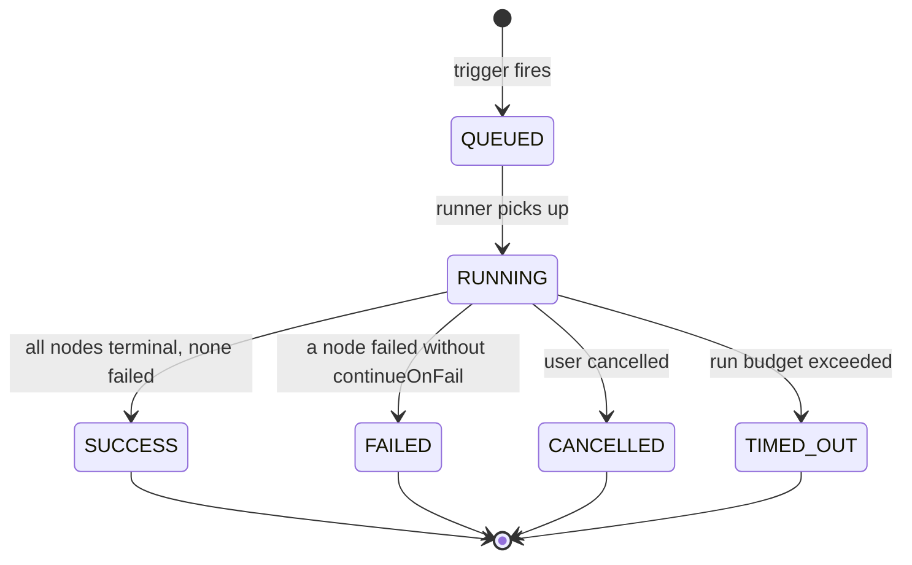
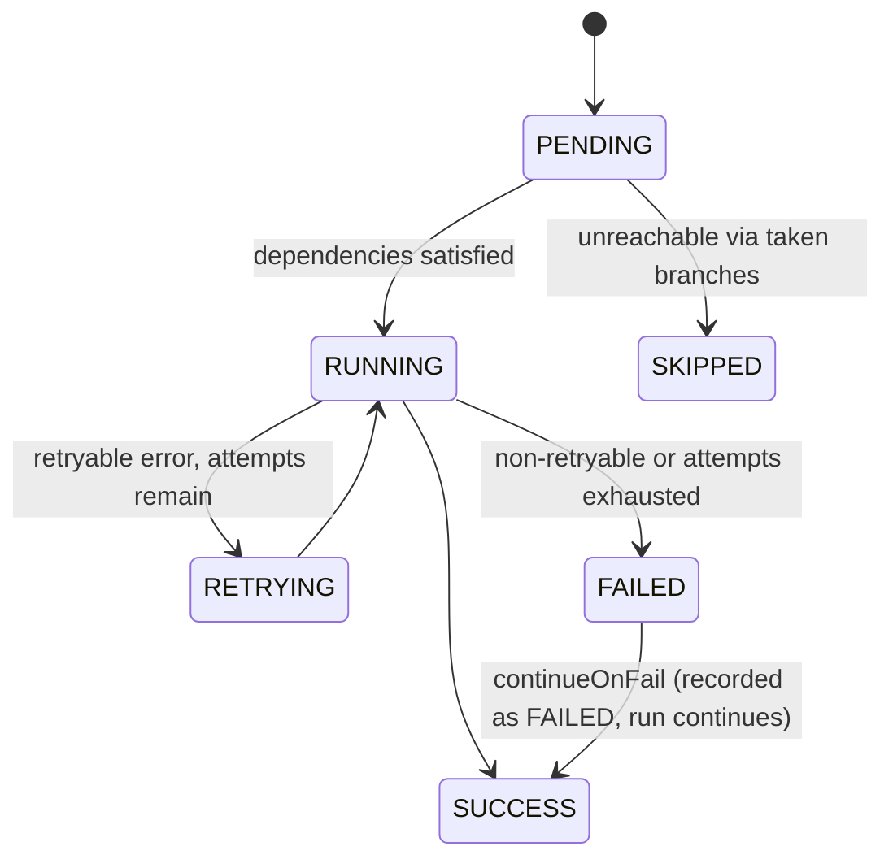

# Execution Engine

**Status:** Specification. Implemented by `AF-M2-01` … `AF-M2-08`.
**Read before:** touching the runner, retries, data passing, expressions, or execution records.

This is the component the entire product depends on and the one that does not exist yet. Its correctness properties are also the product's differentiators — "you can see exactly what happened and why" is not a UI feature, it is a runtime design decision made here.

---

## 1. Correctness properties

Non-negotiable. Every design choice below serves one of these.

| # | Property | Why it matters commercially |
|---|---|---|
| P1 | **No silent skips.** Every node in the compiled graph ends in a recorded terminal state, including `SKIPPED` with a reason. | The market analysis names "silent failures in branching logic" as a top complaint against n8n. Our trace must never have a hole. |
| P2 | **Crash-resumable.** A process death mid-run resumes at the last completed node; completed side effects are not repeated. | This is the "zero DevOps, production-ready" claim. |
| P3 | **Immutable history.** Editing a workflow never changes what a past run shows. | Compliance-grade audit trail (PRD §5.4). |
| P4 | **Attributable.** Every node records input, output, duration, attempt, tokens, and cost. | Cost intelligence and analytics are `SUM()` over these columns, not a later log-mining project. |
| P5 | **Bounded.** Every node has a timeout; every run has caps on duration, node count, and stored IO. | One tenant cannot degrade another. |
| P6 | **Deterministic ordering.** The same graph produces the same execution order. | Reproducible debugging. |

---

## 2. Execution lifecycle



Per-node:



---

## 3. Pipeline

```
trigger → create Execution(QUEUED) → emit Inngest event
        → load graph snapshot
        → compile()   : DB rows → typed DAG
        → validate()  : shared with the editor's linter
        → plan()      : topological levels, deterministic tie-break
        → run()       : per-node step.run, in dependency order
        → finalize()  : rollups, status, duration
```

### 3.1 Compile

`src/engine/compile.ts` turns persisted `Node`/`Connection` rows into an internal graph:

- resolve each `node.type` against the registry; unknown type → compile error
- apply `migrate()` when `node.typeVersion < definition.version`
- parse `node.data` with `configSchema`; failures collected per node, not thrown on the first
- build adjacency by `(fromNodeId, fromOutput) → (toNodeId, toInput)`
- reject cycles (Loop is an explicit node, not a graph cycle)
- reject a missing trigger, an unconnected required input, and unreachable nodes (warning, not error)

Compile errors are structured `{ nodeId, path, message }` so the editor can point at the exact field. `validate()` is the *same function* the canvas linter calls — one implementation, so what lints clean runs, and what runs must lint clean.

### 3.2 Plan

Topological sort with deterministic tie-breaking (by node id) so identical graphs execute identically. Produces levels; nodes in the same level with no interdependency may run concurrently, bounded by a per-run concurrency limit.

### 3.3 Run

```ts
for (const node of plan.order) {
  if (!isReachable(node, takenBranches)) {
    await recordSkipped(node, reasonFor(node, takenBranches));
    continue;
  }
  const items = gatherInputs(node, outputsByNode);
  await step.run(`node:${node.id}`, async () => {
    return executeWithRetry(node, items);
  });
}
```

Key points:
- **`step.run` per node** gives P2 for free: Inngest memoizes completed steps, so a resumed run replays cached results rather than re-invoking side effects.
- **Reachability drives skipping** (P1). When `core.condition` emits on `true`, the `false` edge is marked untaken; any node whose only path to the trigger runs through untaken edges is `SKIPPED` with the reason `"branch not taken at node 'Is Premium?' (false)"`.
- **Inputs are gathered, not pushed.** A node with multiple incoming connections receives the concatenation in deterministic edge order; `core.merge` exists for explicit semantics.

### 3.4 Finalize

Aggregate node durations, token counts, and cost onto `Execution`; set terminal status; emit an `execution.completed` event for downstream consumers (alerts, quotas, dashboards).

---

## 4. Data model between nodes

Every node consumes and produces the same shape:

```ts
{ items: Array<{ json: Record<string, unknown>; binary?: Record<string, BinaryRef> }> }
```

Rationale: a uniform item array makes fan-out, merge, batching, and looping *generic* — they are properties of the runner, not of each node. This is the n8n item model, chosen deliberately because it is proven at scale for exactly this problem.

Rules:
- A node that logically produces one result returns a single-item array.
- **Binary is never inlined.** Files go to blob storage; items carry a `BinaryRef`. Execution records stay small (P5).
- A node receiving zero items generally emits zero items and completes as `SUCCESS`. Nodes for which that is meaningless declare `inputs[].required`.

---

## 5. Expressions

Config values may contain `{{ ... }}` templates, resolved immediately before `execute`.

| Expression | Resolves to |
|---|---|
| `{{ $json.email }}` | field on the current item |
| `{{ $items[0].json.id }}` | indexed access into input items |
| `{{ $node["Fetch User"].json.name }}` | output of a named upstream node |
| `{{ $execution.id }}` | current execution id |
| `{{ $workflow.id }}` / `{{ $workflow.name }}` | workflow metadata |
| `{{ $env.REGION }}` | allowlisted environment value |
| `{{ $now }}` | ISO timestamp at resolution time |

**Implementation constraint (security-critical): expressions are parsed and resolved, never evaluated.** No `eval`, no `new Function`, no `vm`. The resolver walks a parsed path against a context object. This costs us arbitrary JavaScript in expressions, and we accept that — a sandboxed Code node (Phase 2+) is the answer for users who need computation, and it gets its own isolation design (`docs/architecture/security.md` §6).

Failure behavior: an unresolvable path throws `ExpressionError` naming the node, the field, and the expression. It does **not** silently become `undefined` — that is how workflows post empty messages to customers.

---

## 6. Error handling and retries

Per-node policy, from `definition.defaultRetry` overridden by user config:

```ts
{ maxAttempts: 3, backoffMs: 1000 }   // attempts at 0s, 1s, 2s, 4s (capped)
```

- **Retryable** errors: network failures, 429, 5xx, explicit `retryable: true`. Determined by the node, not guessed by the engine.
- **Non-retryable**: 4xx other than 429, config errors, auth failures. Retrying these wastes time and can trip rate limits.
- Each attempt is a `NodeExecution` row with an incrementing `attempt`, so the trace shows the full retry history rather than only the final outcome.
- `continueOnFail`: the node records `FAILED`, emits `{ json: { error } }` items, and the run continues. Off by default — failing loudly is the correct default for automation.
- **Error output port** (M4+): nodes may declare an `error` output so users can build explicit error branches.

Run-level: a node failure without `continueOnFail` marks the run `FAILED` and stops scheduling. In-flight nodes are allowed to finish so their traces are complete.

---

## 7. Timeouts, limits, cancellation

| Limit | Default | Configurable |
|---|---|---|
| Node attempt timeout | 60s (node may override) | per node |
| Run wall-clock | 15 min | per plan |
| Nodes per run | 500 | per plan |
| Items per node output | 10,000 | per plan |
| Stored IO per node | 128 KB (truncated with a marker) | global |
| Concurrent nodes per run | 5 | per plan |
| Concurrent runs per workflow | 10 | per plan |
| Concurrent runs per tenant | plan-dependent | per plan |

Cancellation propagates through `ctx.signal`; nodes that ignore it are killed at their timeout. Cancelled runs mark unstarted nodes `SKIPPED` with reason `"execution cancelled"` — the trace still accounts for every node (P1).

Tenant fairness uses Inngest concurrency keys on `organizationId`, so a runaway workflow cannot starve other tenants (P5).

---

## 8. Records

```
Execution
  id, workflowId, workflowVersionId?, organizationId
  status, trigger (MANUAL|WEBHOOK|SCHEDULE|API|SUBWORKFLOW), mode (PRODUCTION|TEST)
  graphSnapshot Json          -- what actually ran (P3)
  input Json?
  startedAt, finishedAt, durationMs
  error Json?
  nodeCount, tokensIn, tokensOut, costUsd
  createdById

NodeExecution
  id, executionId, nodeId, nodeName, nodeType, typeVersion
  status, attempt
  input Json?, output Json?   -- truncated above the cap
  error Json?, skipReason String?
  startedAt, finishedAt, durationMs
  tokensIn, tokensOut, costUsd
```

`graphSnapshot` is what makes history immutable: the run is interpreted against the graph as it was, not as it is now. Without it, "why did this run fail last Tuesday?" is unanswerable after any edit.

**Never `select` `graphSnapshot`, `input`, or `output` in list queries.** They are large. List views read scalar columns only.

---

## 9. Observability

Three separate audiences — do not conflate them:

| Audience | Surface |
|---|---|
| The user debugging their workflow | Executions UI, built on the tables above. **This is a product feature.** |
| Us debugging AutoFlow | Sentry + structured logs |
| Workspace admins | Aggregate dashboards (M7) |

Every log line inside the engine carries `{ executionId, nodeId, workflowId, organizationId }`. All logging goes through the redacting logger — credentials pass through `NodeExecutionContext`, so an unredacted log inside the engine is a credential disclosure.

---

## 10. Testing requirements

Mandatory, no exceptions (`docs/engineering/engineering_rules.md` §11):

| Area | Cases |
|---|---|
| `compile` | linear · branching · diamond · disconnected · cyclic · unknown type · invalid config · missing trigger |
| `plan` | deterministic order for equivalent graphs · correct level assignment |
| Skip semantics | condition true/false; assert untaken-branch nodes are `SKIPPED` with a reason and **no node is missing** |
| Retry | retryable → retried up to max; non-retryable → single attempt; attempts recorded |
| `continueOnFail` | run proceeds; node still recorded `FAILED` |
| Expressions | nested paths · arrays · missing refs · malformed syntax · **injection attempt is inert** |
| Resume | kill mid-run, resume, assert completed side effects are not repeated |
| Cancellation | in-flight aborts, remainder `SKIPPED`, status `CANCELLED` |
| Limits | item cap, IO truncation marker, node cap, run timeout |
| Isolation | a run cannot read another tenant's credentials or workflows |

---

## 11. Explicitly out of scope for M2

Recorded so they do not creep in:

- Loop / iteration nodes (M4+)
- Sub-workflow invocation (Phase 3)
- Custom Code nodes (needs sandboxing — Phase 2+)
- Agent nodes and multi-agent orchestration (Phase 2, built on this engine)
- Streaming/partial output during a run (Phase 2)
- Distributed state across executions (Phase 3)
- Wait/delay nodes beyond simple sleeps (M4)
