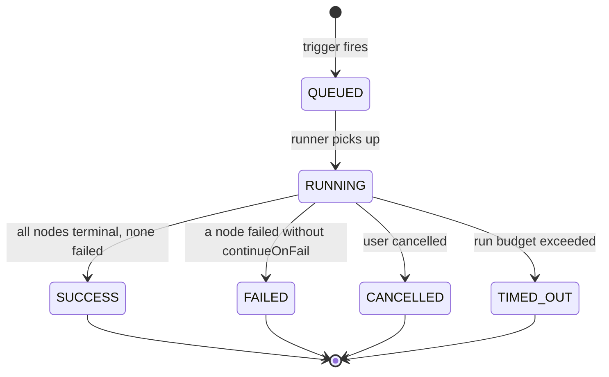
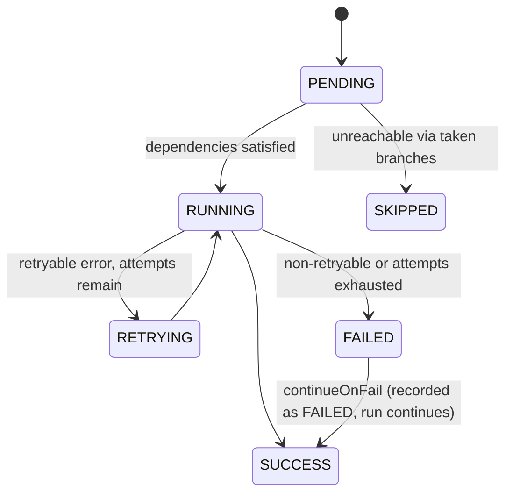

# Execution Engine

**Status:** Specification. Implemented by `AF-M2-01` … `AF-M2-08`.
**Read before:** touching the runner, retries, data passing, expressions, or execution records.

This is the component the entire product depends on and the one that does not exist yet. Its correctness properties are also the product's differentiators — "you can see exactly what happened and why" is not a UI feature, it is a runtime design decision made here.

---

## 1. Correctness properties

Non-negotiable. Every design choice below serves one of these.

| # | Property | Why it matters commercially |
|---|---|---|
| P1 | **No silent skips.** Every node in the compiled graph ends in a recorded terminal state, including `SKIPPED` with a reason. | The market analysis names "silent failures in branching logic" as a top complaint against n8n. Our trace must never have a hole. |
| P2 | **Crash-resumable.** A process death mid-run resumes at the last completed node; completed side effects are not repeated. | This is the "zero DevOps, production-ready" claim. |
| P3 | **Immutable history.** Editing a workflow never changes what a past run shows. | Compliance-grade audit trail (PRD §5.4). |
| P4 | **Attributable.** Every node records input, output, duration, attempt, tokens, and cost. | Cost intelligence and analytics are `SUM()` over these columns, not a later log-mining project. |
| P5 | **Bounded.** Every node has a timeout; every run has caps on duration, node count, and stored IO. | One tenant cannot degrade another. |
| P6 | **Deterministic ordering.** The same graph produces the same execution order. | Reproducible debugging. |

---

## 2. Execution lifecycle



Per-node:



---

## 3. Pipeline

```
trigger → create Execution(QUEUED) → emit Inngest event
        → load graph snapshot
        → compile()   : DB rows → typed DAG
        → validate()  : shared with the editor's linter
        → plan()      : topological levels, deterministic tie-break
        → run()       : per-node step.run, in dependency order
        → finalize()  : rollups, status, duration
```

### 3.1 Compile

`src/engine/compile.ts` turns persisted `Node`/`Connection` rows into an internal graph:

- resolve each `node.type` against the registry; unknown type → compile error
- apply `migrate()` when `node.typeVersion < definition.version`
- parse `node.data` with `configSchema`; failures collected per node, not thrown on the first
- build adjacency by `(fromNodeId, fromOutput) → (toNodeId, toInput)`
- reject cycles (Loop is an explicit node, not a graph cycle)
- reject a missing trigger, an unconnected required input, and unreachable nodes (warning, not error)

Compile errors are structured `{ nodeId, path, message }` so the editor can point at the exact field. `validate()` is the *same function* the canvas linter calls — one implementation, so what lints clean runs, and what runs must lint clean.

### 3.2 Plan

Topological sort with deterministic tie-breaking (by node id) so identical graphs execute identically. Produces levels; nodes in the same level with no interdependency may run concurrently, bounded by a per-run concurrency limit.

### 3.3 Run

```ts
for (const node of plan.order) {
  if (!isReachable(node, takenBranches)) {
    await recordSkipped(node, reasonFor(node, takenBranches));
    continue;
  }
  const items = gatherInputs(node, outputsByNode);
  await step.run(`node:${node.id}`, async () => {
    return executeWithRetry(node, items);
  });
}
```

Key points:
- **`step.run` per node** gives P2 for free: Inngest memoizes completed steps, so a resumed run replays cached results rather than re-invoking side effects.
- **Reachability drives skipping** (P1). When `core.condition` emits on `true`, the `false` edge is marked untaken; any node whose only path to the trigger runs through untaken edges is `SKIPPED` with the reason `"branch not taken at node 'Is Premium?' (false)"`.
- **Inputs are gathered, not pushed.** A node with multiple incoming connections receives the concatenation in deterministic edge order; `core.merge` exists for explicit semantics.
- **Disabled nodes pass through** (AF-M9-04). A node with `Node.disabled = true` is never executed. It is traced `SKIPPED` with reason `"Skipped: node is disabled"` — visibly, per P1, because a node missing from the trace is indistinguishable from one that never existed — and its input passes to its successors rather than severing the branch, matching n8n. Three consequences worth stating:
  - **Reachability wins.** The disabled check runs *after* the branch-taken check, so a disabled node on an untaken branch is skipped as unreachable and its edges are **not** marked taken. Marking them would resurrect the tail of a branch the run never entered.
  - **Pass-through takes the first declared output.** For a disabled branching node there is no condition left to evaluate; taking every output would execute a graph the author never drew.
  - **A disabled node is exempt from config and required-input validation.** It cannot fail a run it does not take part in, and turning a node off is the normal way to park work in progress. Structural checks (cycles, unknown types) still apply, because the engine resolves every node's registration to build the plan.

  **Not covered: disabling a trigger.** The decision to start a run is taken upstream of the engine — in the webhook route, the cron evaluator, or the Run button — and none of them consult `disabled`. A disabled trigger is therefore skipped and passes through *once the run has already been dispatched*, which is not what a user disabling a trigger expects. Tracked as a follow-up, not fixed in AF-M9-04.

### 3.4 Finalize

Aggregate node durations, token counts, and cost onto `Execution`; set terminal status; emit an `execution.completed` event for downstream consumers (alerts, quotas, dashboards).

---

## 4. Data model between nodes

Every node consumes and produces the same shape:

```ts
{ items: Array<{ json: Record<string, unknown>; binary?: Record<string, BinaryRef> }> }
```

Rationale: a uniform item array makes fan-out, merge, batching, and looping *generic* — they are properties of the runner, not of each node. This is the n8n item model, chosen deliberately because it is proven at scale for exactly this problem.

Rules:
- A node that logically produces one result returns a single-item array.
- **Binary is never inlined.** Files go to blob storage; items carry a `BinaryRef`. Execution records stay small (P5).
- A node receiving zero items generally emits zero items and completes as `SUCCESS`. Nodes for which that is meaningless declare `inputs[].required`.

---

## 5. Expressions

Config values may contain `{{ ... }}` templates, resolved immediately before `execute`. All templates compile through `compileTemplate` in `src/features/executions/template.ts` (ADR-0007); the `$`-prefixed context is built by `buildTemplateContext` (AF-M2-03).

**The enriched context is never handed to an executor** (AF-M9-05). The runner builds it once per node inside `makeResolver` and passes the executor two separate things: `context`, the plain accumulated output of upstream nodes, and `resolve(template)`, a closure over the enriched view. Executors must template through `resolve` and must never import `compileTemplate` or `buildTemplateContext` — `registry.test.ts` fails the build if one does.

The reason is that every executor returns `{ ...context, … }`. When `context` *was* the enriched object, `$json`/`$node`/`$execution`/`$workflow`/`$now` were returned with it, and `$json` self-references the accumulated context — so each hop embedded the previous hop's entire payload, the stored `Execution.output` grew superlinearly with node count, and the ADR-0018 per-node output cap was spent on scaffolding the user never asked for. Keeping the enriched view inside a closure makes that structurally impossible rather than a rule to remember.

| Expression | Resolves to | Status |
|---|---|---|
| `{{ $json.field }}` | Field on the accumulated context (alias for the flat upstream bag). | ✅ Shipped |
| `{{ $node.[Node Name].field }}` | Output of a named upstream node, keyed by canvas display name. Use `lookup $node "Name"` for names with dots/spaces. | ✅ Shipped |
| `{{ $execution.id }}` | Current execution id. | ✅ Shipped |
| `{{ $workflow.id }}` | Current workflow id. | ✅ Shipped |
| `{{ $now }}` | ISO-8601 timestamp at context-build time. | ✅ Shipped |
| `{{ $items[0].json.id }}` | Indexed access into input items. | Deferred — items model (Decision A) |
| `{{ $env.REGION }}` | Allowlisted environment value. | Deferred — Phase 2 |

**Implementation constraint (security-critical): expressions are parsed and resolved, never evaluated.** No `eval`, no `new Function`, no `vm`. The resolver walks a parsed path against a context object. This costs us arbitrary JavaScript in expressions, and we accept that — a sandboxed Code node (Phase 2+) is the answer for users who need computation, and it gets its own isolation design (`docs/architecture/security.md` §6).

Failure behavior: an unresolvable path renders as an empty string (Handlebars default). `ExpressionError` is exported for future use when stricter resolution is needed (e.g. required fields that must not be empty). Missing `$node` keys resolve to `""` — no throw, no silent `undefined` injection.

---

## 6. Error handling and retries

Per-node policy, from `definition.defaultRetry` overridden by user config:

```ts
{ maxAttempts: 3, backoffMs: 1000 }   // attempts at 0s, 1s, 2s, 4s (capped)
```

**Where a node's policy comes from** (AF-M9-06). It lives under the reserved key `_run` in `Node.data`, is described by `runPolicySchema` (`src/nodes/shared/run-policy.ts`), and is resolved by `resolveRunPolicy` in this precedence, highest first:

1. the node's own `_run` — `maxAttempts` (1–5), `backoffMs`, `timeoutMs` (250 ms – 5 min), `continueOnFail`
2. the legacy `_timeoutMs` / `_continueOnFail` keys, read-only
3. `definition.defaultRetry` / `definition.timeoutMs`
4. the engine defaults (`ENGINE_RETRIES`, 1 s backoff, 60 s timeout)

`_run` is validated at the save boundary by `validate()` and edited in the config panel's collapsed **Run settings** section. It is deliberately *not* merged into each node's `configSchema`: that schema also drives the config form, so an object field in it would either break the form's introspection or have to be excluded again on the way out.

The two legacy keys are read but never written, and **no data migration ships**. They were never written by the editor, a template, or the public API — the only writers in the repo's history are engine test fixtures — so a migration would be dead code, and "grep the database" is the check AF-M8-12 got burned by, since it only covers the database you point at. Reading four extra keys cannot be wrong; migrating rows that provably do not exist can be.

An inherited timeout that falls outside the bounds is **clamped, not rejected**: tightening a limit must not turn saved workflows into failures.

- **Retryable** errors: network failures, 429, 5xx, explicit `retryable: true`. Determined by the node, not guessed by the engine.
- **Non-retryable**: 4xx other than 429, config errors, auth failures. Retrying these wastes time and can trip rate limits.
- ~~Each attempt is a `NodeExecution` row with an incrementing `attempt`~~. **Reality (AF-M9-06):** there is one row per node, and `attempt` records the attempt it *finished* on — 3 for a node that failed twice and succeeded on the third try, or the last attempt tried for one that failed. Before AF-M9-06 the column carried the Inngest *function* attempt, which is 1 on every normal run, so retries were invisible in the trace entirely. A row per attempt is the better shape for "the full retry history" and remains unbuilt.
- `continueOnFail`: the node records `FAILED`, emits `{ json: { error } }` items, and the run continues. Off by default — failing loudly is the correct default for automation.
- **Error output port** (M4+): nodes may declare an `error` output so users can build explicit error branches.

Run-level: a node failure without `continueOnFail` marks the run `FAILED` and stops scheduling. In-flight nodes are allowed to finish so their traces are complete.

---

## 7. Timeouts, limits, cancellation

| Limit | Default | Configurable |
|---|---|---|
| Node attempt timeout | 60s (node may override) | per node |
| Run wall-clock | 15 min | per plan |
| Nodes per run | 500 | per plan |
| Items per node output | 10,000 | per plan |
| Stored IO per node | 128 KB (truncated with a marker) | global |
| Concurrent nodes per run | 5 | per plan |
| Concurrent runs per workflow | 10 | per plan |
| Concurrent runs per tenant | plan-dependent | per plan |

Cancellation propagates through `ctx.signal`; nodes that ignore it are killed at their timeout. Cancelled runs mark unstarted nodes `SKIPPED` with reason `"execution cancelled"` — the trace still accounts for every node (P1).

Tenant fairness uses Inngest concurrency keys on `organizationId`, so a runaway workflow cannot starve other tenants (P5).

---

## 8. Records

```
Execution
  id, workflowId, workflowVersionId?, organizationId
  status, trigger (MANUAL|WEBHOOK|SCHEDULE|API|SUBWORKFLOW), mode (PRODUCTION|TEST)
  graphSnapshot Json          -- what actually ran (P3)
  input Json?
  startedAt, finishedAt, durationMs
  error Json?
  nodeCount, tokensIn, tokensOut, costUsd
  createdById

NodeExecution
  id, executionId, nodeId, nodeName, nodeType, typeVersion
  status, attempt
  input Json?, output Json?   -- truncated above the cap; NOT WRITTEN YET, see below
  error Json?, skipReason String?
  startedAt, finishedAt, durationMs
  tokensIn, tokensOut, costUsd
```

`graphSnapshot` is what makes history immutable: the run is interpreted against the graph as it was, not as it is now. Without it, "why did this run fail last Tuesday?" is unanswerable after any edit.

**Never `select` `graphSnapshot`, `input`, or `output` in list queries.** They are large. List views read scalar columns only.

**`NodeExecution.input` and `NodeExecution.output` are declared but never written** (found 2026-09-03 during AF-M9-05). The runner persists only `Execution.output`; the per-node columns are always `null`, and `executions.getOne` returns the whole `NodeExecution` row, so the API ships two permanently-null fields to the client. Per-node IO is what makes a trace debuggable — "what did this node actually receive?" is the first question anyone asks — so this is a real hole in AF-A-05, not a cosmetic one. Tracked as **AF-M9-18**; it needs a size cap and a retention story (AF-M8-06, ADR-0018) rather than a naive write.

---

## 9. Observability

Three separate audiences — do not conflate them:

| Audience | Surface |
|---|---|
| The user debugging their workflow | Executions UI, built on the tables above. **This is a product feature.** |
| Us debugging AutoFlow | Sentry + structured logs |
| Workspace admins | Aggregate dashboards (M7) |

Every log line inside the engine carries `{ executionId, nodeId, workflowId, organizationId }`. All logging goes through the redacting logger — credentials pass through `NodeExecutionContext`, so an unredacted log inside the engine is a credential disclosure.

---

## 10. Testing requirements

Mandatory, no exceptions (`docs/engineering/engineering_rules.md` §11):

| Area | Cases |
|---|---|
| `compile` | linear · branching · diamond · disconnected · cyclic · unknown type · invalid config · missing trigger |
| `plan` | deterministic order for equivalent graphs · correct level assignment |
| Skip semantics | condition true/false; assert untaken-branch nodes are `SKIPPED` with a reason and **no node is missing** |
| Retry | retryable → retried up to max; non-retryable → single attempt; attempts recorded |
| `continueOnFail` | run proceeds; node still recorded `FAILED` |
| Expressions | nested paths · arrays · missing refs · malformed syntax · **injection attempt is inert** |
| Resume | kill mid-run, resume, assert completed side effects are not repeated |
| Cancellation | in-flight aborts, remainder `SKIPPED`, status `CANCELLED` |
| Limits | item cap, IO truncation marker, node cap, run timeout |
| Isolation | a run cannot read another tenant's credentials or workflows |

---

## 11. Explicitly out of scope for M2

Recorded so they do not creep in:

- Loop / iteration nodes (M4+)
- Sub-workflow invocation (Phase 3)
- Custom Code nodes (needs sandboxing — Phase 2+)
- Agent nodes and multi-agent orchestration (Phase 2, built on this engine)
- Streaming/partial output during a run (Phase 2)
- Distributed state across executions (Phase 3)
- Wait/delay nodes beyond simple sleeps (M4)
