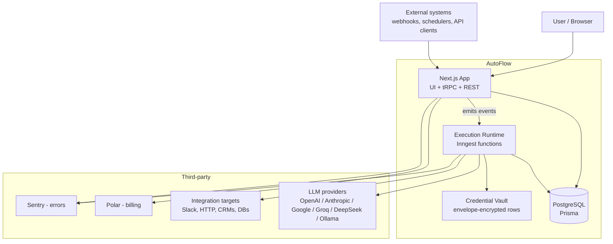
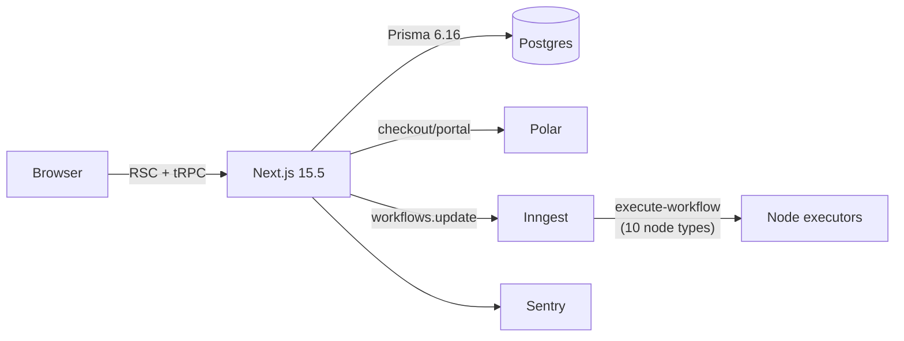
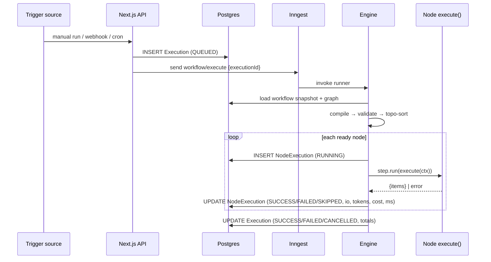
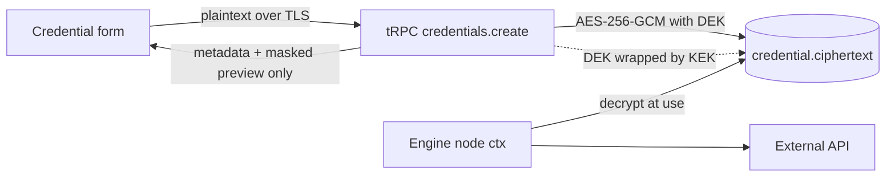

# AutoFlow — Architecture

**Status:** Target architecture with current-state annotations.
**Last updated:** 2026-08-22 (post-audit reconciliation)
**Owner:** Engineering

> **2026-08-22 RECONCILIATION:** the audit (`docs/planning/progress.md` §5) found
> this document's current-state claims stale in both directions: an execution
> engine *does* exist (tutorial-grade Inngest implementation), and the previously
> claimed resolutions of the `NodeType` enum and fake tRPC context *do not* exist.
> Annotations corrected below. Versions reflect `package.json`: Next.js **15.5.4**
> (not 16), Prisma **6.16** (not 7), Biome (not ESLint).

Read alongside `docs/architecture/data_model.md`, `docs/architecture/node_sdk.md`, `docs/architecture/execution_engine.md`, and `docs/architecture/security.md`.

Legend used throughout: **[BUILT]** exists and works · **[PARTIAL]** exists but incomplete · **[PLANNED]** does not exist yet, with the milestone that creates it.

---

## 1. What AutoFlow is, architecturally

AutoFlow is three systems wearing one coat:

1. **A graph editor** — a browser application for authoring a directed graph of typed, configured nodes.
2. **A durable execution runtime** — a server-side engine that compiles that graph and executes it reliably, with per-node observability, retries, and credential injection.
3. **A multi-tenant control plane** — auth, workspaces, RBAC, billing, quotas, audit, and secrets.

Almost every product requirement decomposes into one of those three. A tutorial-grade version of (2) **does exist** (`src/inngest` — Inngest steps, per-node executors, topological execution), but it is not yet the correct, observable runtime this document specifies: no per-node trace records, unvalidated configs, unsigned webhooks, and a scattered executor layout. The architecture below is therefore organized around *rebuilding that engine to spec* behind the node registry, and making everything else a client of it.

---

## 2. System context



**Boundary rule:** the web tier authors and observes; the runtime executes. The web tier never performs a node's side effect, and the runtime never renders UI. Any code that violates this creates a second, divergent implementation of node behavior — the single most expensive mistake available in this codebase.

---

## 3. Layers

| Layer | Directory | Responsibility | State |
|---|---|---|---|
| Routes | `src/app/**` | URL → page composition, auth guard, SSR prefetch. No business logic. | **[BUILT]** |
| Feature UI | `src/features/*/components` | Client components, canvas, forms, lists | **[PARTIAL]** |
| Data access hooks | `src/features/*/hooks` | TanStack Query wrappers over tRPC | **[BUILT]** |
| API | `src/trpc`, `src/features/*/server/routers.ts` | Typed RPC, authz, validation | **[PARTIAL]** — `workflows`, `credentials`, `executions` routers; configs unvalidated (`z.any()`) |
| Public API | `src/app/api/{webhooks,v1}` | Webhook ingress (Stripe + Google Form routes exist but **unsigned/unscoped — AF-A-01**), REST for external callers | **[PARTIAL]** |
| Node registry | `src/nodes/**` | The catalogue of what a node *is* and what it *does* | **[PLANNED M1]** — 10 executors currently scattered in `src/features/executions/components/*/executor.ts`, keyed by Prisma enum |
| Engine | `src/engine/**` + `src/inngest/functions.ts` | Graph compile, validate, topologically execute, resolve expressions | **[PARTIAL]** — tutorial-grade topological execution works (`src/inngest/utils.ts`); no per-node records, no expression resolver, no SKIPPED semantics |
| Durable jobs | `src/inngest/**` | Long-running/retryable execution, cron, OAuth refresh | **[PARTIAL]** — real `execute-workflow` function exists |
| Infra libs | `src/lib/**` | db, auth, polar, crypto (envelope AES-256-GCM, `CURRENT_KEY_VERSION`), ai provider registry, logger | **[PARTIAL]** — Cryptr legacy path still used by credentials until AF-M3-02 |
| Persistence | `prisma/**` | Schema + migrations | **[PARTIAL]** — 9 tables incl. `Execution`, `Credential`; graph-only era is over |

---

## 4. Current architecture (as of 2026-08-22)



What that diagram is honestly saying: a tutorial-grade n8n clone works end to end — users author a graph, save it, deploy it, run it, and watch execution history. The engine is real but thin: no per-node trace records, no config validation, unsigned webhook ingress, and executors keyed by an enum.

**Concrete gaps in the current build:**
- `Editor` seeds nodes/edges from the server but only persists via the explicit Save button (`workflows.update`); there is no autosave or conflict handling.
- ~~`EditorSaveButton` has an empty handler~~ **False as of 2026-08-22:** it calls `useUpdateWorkflow` (`editor-header.tsx:24`). Save works; conflict UX does not exist.
- `NodeType` is a Postgres enum with 10 values (`prisma/schema.prisma:96`) — **not** dropped despite prior claims; see `AF-M1-02` (reopened).
- `createTRPCContext` still returns hardcoded `{ userId: 'user_123' }` (`src/trpc/init.ts:11`) — **not** removed despite prior claims; see `AF-M0-04`.
- Page prefetches do **not** swallow errors — the claimed defect never existed in this codebase; verified clean (`src/features/*/server/prefetch.ts`).
- Webhook routes accept unauthenticated, unsigned payloads with arbitrary `workflowId`s (`AF-A-01`).
- Zero tests, zero CI, 303 lint errors (`AF-M0-06`, `AF-A-06`).

---

## 5. Target architecture

### 5.1 Node registry — the core abstraction

Everything the user can place on the canvas is a **node definition**. A definition is the single source of truth for that node's identity, configuration schema, ports, credential requirements, and runtime behavior. The editor, the validator, the config form, the API, and the runner are all *generic consumers* of the registry — none of them contains per-node logic.

```
src/nodes/
├── registry.ts              # server registry (definition + execute)
├── manifest.ts              # client-safe registry (definition only)
├── types.ts                 # NodeDefinition, NodeExecutionContext, PortDef...
├── core/
│   ├── manual-trigger/
│   ├── webhook-trigger/
│   ├── schedule-trigger/
│   ├── condition/
│   ├── loop/
│   ├── merge/
│   └── set/
├── http/request/
├── ai/
│   ├── llm/
│   └── extract/
└── integrations/
    ├── slack/send-message/
    └── postgres/query/
```

Each node folder:

| File | Environment | Contains |
|---|---|---|
| `definition.ts` | isomorphic | type id, version, category, label, icon, `configSchema` (Zod), input/output ports, credential requirements |
| `execute.ts` | **server only** (`import "server-only"`) | the `execute(ctx)` implementation |
| `index.ts` | server | composes the two |
| `*.test.ts` | test | unit tests for `execute` |

**Why this split is load-bearing:** the client needs the schema to render a config form and validate the canvas; the client must never receive the implementation. `manifest.ts` imports only `definition.ts` files, so the bundler physically cannot pull `execute` into the browser bundle.

**Consequences of the registry design:**
- Adding a node is adding a folder. No migration, no editor change, no API change.
- Config forms are generated from the Zod schema, so validation in the canvas (PRD §5.2 "linting") is free and cannot drift from runtime validation.
- Node config is versioned (`version: number`), enabling forward migration of saved configs when a node's schema changes.
- The `NodeType` Prisma enum is deleted; `Node.type` stays a `String` validated against the registry at write time and at compile time.

Full contract: `docs/architecture/node_sdk.md`.

### 5.2 Execution runtime



Design commitments:

- **Durability comes from Inngest steps, not from our own retry loop.** Each node runs inside `step.run(...)`, so a crash resumes at the last completed node rather than re-running side effects.
- **Immutable run records.** `Execution` snapshots the graph it ran (`graphSnapshot Json`). Editing a workflow never changes the history of past runs — this is the PRD's "immutable execution logs" requirement and it is only cheap if designed in now.
- **Explicit skip semantics.** When a `Condition` node emits on `true`, everything reachable only via `false` is written as `SKIPPED`, not left absent. This directly targets the "silent failures in branching logic" gap called out in the market analysis: the trace shows *why* a branch did not run.
- **Data model between nodes:** every node returns `{ items: Array<{ json: Record<string, unknown>, binary?: BinaryRef[] }> }`. Uniform shape means fan-out, merge, and loop nodes are generic.
- **Expressions are resolved, not evaluated.** `{{ $node["Fetch"].json.email }}` is parsed into a path and resolved against the run context. No `eval`, no `new Function`. Arbitrary user JavaScript is a separate, sandboxed Code node (M7+), not the expression language.
- **Cost and tokens are first-class fields** on `NodeExecution`, not something derived later from logs. Every analytics and budget requirement in the PRD reduces to `SUM()` over those columns.

Full algorithm, state machine, and failure semantics: `docs/architecture/execution_engine.md`.

### 5.3 Credentials



- Envelope encryption: a per-credential data key encrypts the payload; the data key is wrapped by a master key from the environment (`CREDENTIAL_MASTER_KEY`), with `keyVersion` on the row so rotation and later KMS/BYOK migration are mechanical.
- **There is no read path for plaintext.** No tRPC procedure returns decrypted credential data, ever. The only decrypt call site is inside the engine's node context construction.
- OAuth refresh is a scheduled Inngest function scanning `expiresAt`, with failure surfaced as a workspace alert — this is the "N8N tokens silently expire and workflows break" gap.

Details and threat model: `docs/architecture/security.md`.

### 5.4 Multi-model AI

A provider registry (`src/lib/ai/registry.ts`) maps `provider:model` → `{ adapter, contextWindow, capabilities, inputCostPer1M, outputCostPer1M }`. The AI node config selects a model from the registry, plus an optional fallback chain.

- **Routing:** config-driven (explicit model, or a rule: cheapest-capable / lowest-latency / A-B bucket).
- **Cost estimate before run:** token-count the resolved prompt against the model's pricing; surfaced in the editor.
- **Actual cost after run:** usage from the AI SDK response written to `NodeExecution`.
- **Cache:** `hash(provider, model, prompt, params)` → `AiResponseCache` with TTL, keyed per-workspace to avoid cross-tenant leakage.
- The five `@ai-sdk/*` packages are already installed; only Groq is wired, in a demo function. Ollama/local support is an adapter, not a special case.

### 5.5 Multi-tenancy and RBAC

Current model: `Workflow.userId` — a single-owner world with no sharing, no roles, and no workspace.

Target model: `Organization` → `Membership(role)` → `Workspace` → resources. **This lands in M6, and that is deliberately earlier than "governance" would normally rank**, because re-parenting ownership touches every query, every router, every prefetch, and every migration written before it. The longer it waits the more it costs. See ADR `docs/decisions/0005-tenancy-timing.md`.

Roles: `OWNER`, `ADMIN`, `EDITOR`, `VIEWER`. Enforced in a tRPC middleware (`orgProcedure(minRole)`) that resolves membership once per request, not ad hoc per resolver.

### 5.6 Observability

Three distinct concerns, often conflated:

| Concern | Audience | Mechanism |
|---|---|---|
| Execution traces | The user debugging their workflow | `Execution`/`NodeExecution` rows rendered in the Executions UI |
| Application errors | Us | Sentry (already wired) |
| Product/ops metrics | Us + workspace admins | Aggregates over execution tables; dashboard in M7 |

The first is a **product feature** and the primary competitive claim ("Agent Builder has no observability"). It must not be implemented as "read the Inngest dashboard".

---

## 6. Key request lifecycles

### 6.1 Load the editor
`app/(dashboard)/(editor)/workflows/[workflowId]/page.tsx` → `requireAuth()` → `prefetchWorkflow()` (server, hydrates the query cache) → `<Editor>` reads via `useSuspenseWorkflow` → maps `Node[]`/`Connection[]` to React Flow `nodes`/`edges`. **[BUILT]**

### 6.2 Save the graph **[PARTIAL]**
A save path exists (`workflows.update` persists nodes + connections in a transaction), but without registry config validation (AF-A-04) or optimistic-concurrency conflicts. Target shape: canvas mutation → debounced dirty state → `workflows.saveGraph({ workflowId, nodes, edges, clientRevision })` → server validates every node's config against its registry schema → transactional diff → bump `revision` → return canonical graph. Conflict returns `CONFLICT`; client offers reload.

### 6.3 Run a workflow **[PLANNED M2]**
See §5.2 sequence diagram.

### 6.4 Webhook trigger **[PLANNED M4]**
`POST /api/webhooks/:workflowId/:path` → look up active deployed version → verify signature/secret → persist raw payload → create `Execution` → emit Inngest event → respond `202` immediately (or hold for a `Respond` node in sync mode, with a hard timeout).

---

## 7. Technology choices and trade-offs

| Choice | Why | Cost we accept |
|---|---|---|
| Next.js 15 App Router | One deployable for UI + API; RSC prefetch removes a whole class of loading states | On 15.5.4 today; the doc-set's "Next.js 16" references are aspirational and should not drive API assumptions |
| tRPC | End-to-end types with zero codegen; fast internal iteration | Not a public API — a separate REST surface is required for external callers (M8) |
| Prisma 6 + Postgres | Migrations, relations, JSON columns for graph/config; one store for OLTP + run history | Run history in Postgres will need partitioning/archival by ~10⁷ rows (M8) |
| Inngest | Durable steps, retries, concurrency, cron without us operating a queue — this *is* the "zero DevOps" claim | Vendor dependency on the critical path; needs an abstraction seam if self-hosting (Phase 3) is ever real |
| React Flow (`@xyflow/react`) | Mature canvas: handles, toolbars, minimap, viewport | Performance work needed past ~200 nodes |
| Better Auth | Sessions + OAuth + Polar plugin integration | SSO/SCIM for enterprise IdPs must be validated before promising Okta |
| Zod v4 | One schema drives validation, TS types, and generated config forms | Form generation needs a disciplined subset of Zod (see `docs/architecture/node_sdk.md`) |
| Polar | Billing already integrated | Usage-based metering for quotas is not yet wired |

---

## 8. Non-functional targets

| Property | Target | Where enforced |
|---|---|---|
| Trigger → first node start | p50 < 1s (excl. LLM latency) | Engine, Inngest concurrency config |
| Execution durability | No lost runs; resume mid-graph after crash | Inngest `step.run` per node |
| Tenant isolation | No query returns another tenant's row | `orgProcedure` + repository layer + integration tests |
| Credential secrecy | Plaintext never leaves the runtime | Encryption at rest, no read path, log redaction |
| Availability | 99.9% control plane | Managed hosting, health checks |
| Editor responsiveness | 60fps to 200 nodes | Memoized node components, virtualized panels |
| Blast radius | One tenant cannot starve another | Per-org Inngest concurrency keys + quotas (M7) |

---

## 9. Known architectural debt

| # | Debt | Impact | Resolution |
|---|---|---|---|
| A1 | `NodeType` enum in Postgres (10 values) — **still present** despite prior "resolved" claims | A migration per node type; registry can't be the source of truth | `AF-M1-02` (reopened) |
| A2 | ~~No `Execution` model~~ **Partially resolved:** run-level rows exist; no per-node records, no io/tokens/cost columns | Observability is status-only; debugging is guesswork | `AF-A-05`, then `AF-M2-01` |
| A3 | Ownership is `userId`, not org | Every query and router rewritten later; no sharing/RBAC possible | `AF-M6-01` (deliberately early) |
| A4 | Fake tRPC context `user_123` — **still present** despite prior claims | Anyone building on `baseProcedure` gets a silent authz bypass | `AF-M0-04` (reopened) |
| A5 | ~~Prefetch errors swallowed~~ **Never existed** in this codebase — verified clean 2026-08-22 | None | Closed as N/A |
| A6 | No test harness at all | Every change is unverified; engine work is untestable | `AF-M0-06` |
| A7 | Polar config literals (unverified scope) + no env validation, `.env.example`, or logger | Environment-coupled boot; secrets unredacted in logs | `AF-M0-03/07/08` |
| A8 | Webhook ingress unsigned/unscoped | Any caller can trigger any workflow | `AF-A-01` |
| A9 | Sentry example routes, boilerplate README, lint debt (303 errors) | Noise; blocks CI gates | `AF-M0-02`, `AF-A-06` |

---

## 10. What this architecture deliberately does not do (yet)

Recorded so nobody re-litigates it mid-sprint:

- **No self-hosting story.** Inngest and managed Postgres are on the critical path. Self-host is Phase 3 and will require an execution-runtime abstraction seam. Note the source documents disagree on this — one lists self-hosting in Phase 1. Treat Phase 3 as the decision.
- **No microservices.** One Next.js deployable plus Inngest until there is a measured reason otherwise.
- **No custom queue/worker fleet.** That is the DevOps burden we are selling against.
- **No agent framework.** Agents are a node category built *on* the execution engine (Phase 2), not a parallel runtime.
- **No plugin/marketplace runtime.** Third-party code execution is a serious sandboxing problem (`docs/architecture/security.md` §6) and is Phase 3.
