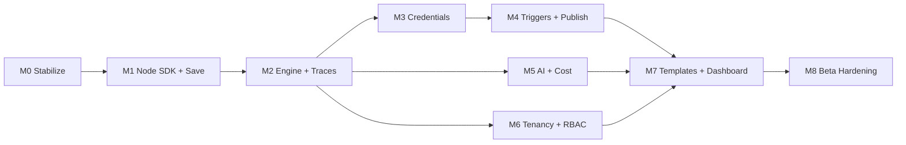

# AutoFlow — Implementation Plan

**Last updated:** 2026-08-02
**Horizon:** M0 → Public Beta (~26 weeks), then Phase 2 (agents) and Phase 3 (enterprise)
**Baseline:** the audited state in `docs/planning/progress.md` — SaaS shell + workflow CRUD + non-persisting canvas, no execution engine.

---

## 1. Guiding principles

1. **Vertical slices, not horizontal layers.** Ship "a user can run a 3-node workflow and see the trace" before "we support 100 node types". A thin end-to-end path exercises every layer and exposes design errors while they are still cheap.
2. **The engine is the product.** Every marketing claim — observability, multi-model, agents, cost intelligence, governance — is a client of the execution runtime. Nothing else should be built until it exists (M2).
3. **Pay structural costs early.** Tenancy (M6) and the node registry (M1) get more expensive every week they wait, because every subsequent line of code assumes their absence. Features that are merely *valuable* can wait; features that are *structural* cannot.
4. **Breadth is the last thing, not the first.** Node count and connector count are a function of a good Node SDK. With the SDK, a connector is a day. Without it, it is a rewrite. Build the SDK; count nodes later.
5. **No demoware.** A feature that cannot survive a refresh, a retry, or a second tenant is not shipped, it is staged.

---

## 2. Scope reconciliation — what we are cutting and why

The source documents are internally inconsistent. `Autoflow_PRD.md` scopes Phase 1 at ~500 nodes with self-hosting in Phase 3; `I want to build Autoflow_...md` scopes Phase 1 at 5,000+ integrations *plus* self-hosting, multi-agent orchestration, RAG, and Git version control. Both describe 3–4 months. Neither is reachable from the current baseline — the platform cannot execute a single node today.

**This plan treats the PRD as the authority and applies explicit cuts.** Each cut below is a recorded decision, not an oversight.

| PRD / vision asks for | We ship by Beta | Rationale | Deferred to |
|---|---|---|---|
| ~500 nodes at launch | **25 nodes** | The top ~25 (HTTP, webhook, schedule, condition, loop, merge, set, LLM, extract, Slack, Gmail, Postgres, Sheets, Airtable, HubSpot, …) cover the large majority of real workflows. Node *count* is a function of the SDK; ship the SDK, then scale count. | Phase 2 (→100), Phase 3 (→500) |
| 5,000+ integrations Phase 1 | Not attempted | Zapier's breadth is a decade and a partner org. Competing on breadth from zero is a losing frame; compete on depth + AI + observability. | Phase 3 / partner strategy |
| 50 templates | **20 templates** | Enough to cover onboarding for 4 verticals. | Phase 2 |
| SSO: Google, GitHub, **Okta** | Google + GitHub | Enterprise IdP (SAML/SCIM) is a multi-week project with a real compliance surface and no design-partner demand yet. | Phase 3 |
| Self-hosting | Not attempted | Inngest + managed Postgres are on the critical path; self-host requires an execution-runtime abstraction seam. PRD already places this in Phase 3. | Phase 3 |
| Multi-agent orchestration | Not attempted | Agents are a node category on top of the engine. Building them first produces a prototype that cannot run in production — precisely the OpenAI Agent Builder failure mode we are selling against. | Phase 2 |
| RAG / knowledge base | Not attempted | Depends on the engine + credentials + storage. | Phase 2 |
| Marketplace | Not attempted | Requires third-party code sandboxing. | Phase 3 |
| Public REST + GraphQL + SDK | REST v1 (read + trigger) only | GraphQL and SDKs need a stable domain model; publishing one early locks in mistakes. | Phase 3 |
| A/B testing, ROI dashboards, benchmarking | Not attempted | Needs a corpus of real executions to be meaningful. | Phase 2/3 |

**What Beta *does* deliver that the competition does not:** a workflow you can author visually, run durably, and debug node-by-node with per-node inputs, outputs, timing, token usage, and dollar cost — across five model providers, with encrypted credentials and workspace RBAC. That is a defensible, honest Phase 1.

---

## 3. Milestone overview

| # | Milestone | Duration | Exit condition (one sentence) |
|---|---|---|---|
| M0 | Stabilize the base | 1 wk | The repo is honest, tested, and safe to build on. |
| M1 | Graph persistence + Node SDK | 3 wks | A user can build and save a real multi-node graph that survives refresh. |
| M2 | **Execution engine + traces** | 4 wks | A user can run that graph and inspect every node's input, output, and error. |
| M3 | Credential vault + real connectors | 3 wks | Workflows can authenticate to external systems without secrets leaking. |
| M4 | Triggers, publish, versioning | 2 wks | Workflows run themselves — on a webhook or a schedule — from a published version. |
| M5 | Multi-model AI + cost | 3 wks | Every run reports tokens and dollars; models are swappable with fallback. |
| M6 | Tenancy, RBAC, audit, SSO | 3 wks | Teams share a workspace with roles, and every action is audited. |
| M7 | Templates, dashboard, quotas | 3 wks | A new user reaches a working automation in <15 minutes; usage is metered. |
| M8 | Beta hardening + public API | 4 wks | External load, external callers, and external scrutiny do not break it. |

**Total to Public Beta: ~26 weeks** at 2–3 engineers. At 1 engineer, roughly double. This is the honest number; the 3–4 month figure in the PRD assumed a starting point that does not match the repository.

M3 and M5 are parallelizable after M2. M6 can start any time after M2 but must complete before M7 (quotas and dashboards are per-workspace concepts).

---

## 4. Milestones in detail

### M0 — Stabilize the base · 1 week

**Goal:** eliminate the known defects and the "we have no way to verify anything" problem before adding surface area.

**Deliverables**
- Commit the pending React Flow work currently sitting unstaged.
- Fix the pagination `count` that ignores the search filter.
- Extract the hardcoded Polar product ID to `POLAR_PRODUCT_ID` / `NEXT_PUBLIC_POLAR_PRODUCT_ID`; fix `POLAR_SUCCESS_URL` being read client-side without a `NEXT_PUBLIC_` prefix.
- Remove the fake `{ userId: 'user_123' }` tRPC context.
- Replace silent `.catch(() => {})` prefetch swallows with logged, rendered error states.
- Delete dead artifacts: `Post` table, `sentry-example-*` routes, unused imports (`title` from `process`).
- Stand up Vitest + Testing Library + a Playwright smoke test; add a CI workflow running `lint`, `build`, `test`.
- Add a real `README.md` and `.env.example`.
- Add `src/lib/logger.ts` with mandatory redaction of secret-shaped keys.

**Exit criteria:** CI is green on `main`; `npm test` exists and runs; no known defect from the audit remains open; a new contributor can go from clone to running app using only `docs/operations/environment_setup.md`.

**Risk:** none material. This is the cheapest week in the plan and it de-risks every week after it.

---

### M1 — Graph persistence + Node SDK · 3 weeks

**Goal:** the canvas becomes a real authoring tool over a real node catalogue.

**Deliverables**
- **Node SDK** (`src/nodes/types.ts`): `NodeDefinition`, `PortDef`, `NodeExecutionContext`, `NodeResult`, `CredentialRequirement`. Full contract in `docs/architecture/node_sdk.md`.
- **Registry + manifest split**: `registry.ts` (server, includes `execute`) and `manifest.ts` (client-safe, definitions only), with `import "server-only"` guarding every `execute.ts`.
- **Drop the `NodeType` enum**; `Node.type` becomes a registry-validated string. Add `Node.typeVersion`, `Node.disabled`, `Node.notes`.
- **`workflows.saveGraph`** mutation: transactional node/edge diff, server-side config validation against each node's Zod schema, optimistic concurrency via `Workflow.revision`.
- **Autosave** (debounced ~1.5s) + explicit Save + dirty indicator + conflict handling. The Save button stops being a no-op.
- **Node palette**: searchable, category-grouped, driven entirely by the manifest.
- **Config panel**: form auto-generated from the node's Zod schema (string/number/boolean/enum/textarea/secret-ref/expression field types).
- **Canvas validation**: invalid config → red node + inline reasons, computed from the same schemas. Cycle detection. Orphan/unreachable-node warnings.
- **7 node definitions with no side effects yet**: Manual Trigger, Webhook Trigger (definition only), Schedule Trigger (definition only), Set, Condition, Merge, HTTP Request.

**Exit criteria:** a user drags 5 nodes onto the canvas, configures them, refreshes the browser, and sees exactly what they built; an invalid config is visibly flagged before any run exists; adding an 8th node type requires touching only `src/nodes/`.

**Risks**
- *Zod-to-form generation over-reach.* Mitigation: support a documented subset of Zod and fail loudly on unsupported constructs rather than rendering something wrong.
- *Save/concurrency edge cases.* Mitigation: revision-based conflict detection from day one; do not attempt CRDT/multiplayer.

---

### M2 — Execution engine + traces · 4 weeks · **the milestone that matters**

**Goal:** workflows execute durably and are debuggable.

**Deliverables**
- **Data model**: `Execution` (status, trigger, mode, `graphSnapshot`, timings, totals, error) and `NodeExecution` (per-node status, input, output, error, attempt, ms, tokens, cost). Indices for the executions list and per-workflow queries.
- **Graph compiler** (`src/engine/compile.ts`): DB graph → validated internal DAG; rejects cycles, unknown node types, invalid configs, missing required inputs.
- **Runner** (`src/engine/run.ts`): topological execution, each node in an Inngest `step.run`, per-node timeout, retry with exponential backoff honoring the node's retry policy, `continueOnFail`, cancellation.
- **Branch semantics**: `Condition` emits on `true`/`false`; nodes reachable only through the untaken branch are recorded as `SKIPPED` with the reason. No silent gaps in the trace.
- **Expression resolver** (`src/engine/expressions.ts`): `{{ $json.x }}`, `{{ $node["Name"].json.x }}`, `{{ $env.X }}`, `{{ $execution.id }}` — parsed and resolved, never `eval`'d.
- **Item model**: uniform `{ items: [{ json, binary? }] }` in and out of every node, enabling generic fan-out and merge.
- **`executions` router**: list (filter by workflow/status/date), get one with node traces, cancel, retry, retry-from-node.
- **Executions UI**: replaces the stub. Run list with status/duration/cost; run detail with a node timeline, per-node input/output JSON viewers, error surface with stack, and a "re-run from here" action.
- **Editor integration**: "Test workflow" and "Test this node" run against the live engine and paint results onto the canvas.

**Exit criteria:** a webhook-less manual run of a 5-node workflow containing a branch, an HTTP call, and a deliberate failure produces a complete trace in which every node is `SUCCESS`, `FAILED`, or `SKIPPED` with a reason; killing the process mid-run and restarting resumes without re-executing completed side effects.

**Risks**
- *Scope creep into agents/loops.* Mitigation: `Loop` and `Code` nodes are explicitly out of M2.
- *Inngest step semantics misunderstood* (step memoization, payload size limits). Mitigation: spike in week 1; large payloads spill to blob storage with a reference, not inline.
- *Trace payload size.* Mitigation: truncate stored IO above a threshold with a "truncated" marker and a size cap per run.

---

### M3 — Credential vault + real connectors · 3 weeks

**Goal:** workflows can talk to real systems, safely.

**Deliverables**
- `Credential` model + envelope encryption (AES-256-GCM, wrapped DEK, `keyVersion`), `src/lib/crypto.ts` with tests including tamper-detection.
- Credential type registry (API key, bearer, basic, header, OAuth2 generic) mirroring the node registry pattern.
- Credentials UI: create/edit/delete/test-connection, masked display, "used by N workflows".
- Node ↔ credential binding, injected into `NodeExecutionContext` at execution time only.
- OAuth2 authorization-code flow + a scheduled refresh function; refresh failure raises a visible alert rather than a silent 401 at 3am.
- **Connectors (8):** Slack, Gmail/SMTP, Google Sheets, Postgres, Airtable, HubSpot, OpenAI-compatible HTTP, Webhook-out.
- Log/Sentry redaction verified by test.

**Exit criteria:** a credential's plaintext appears in no API response, log line, or Sentry event — proven by an automated test; an expired OAuth token refreshes without user action; a wrong credential produces a clear, actionable node error.

**Risks:** key management for local dev vs. production. Mitigation: `CREDENTIAL_MASTER_KEY` required at boot, app refuses to start without it, dev key documented as non-secret and unusable in production.

---

### M4 — Triggers, publish, versioning · 2 weeks

**Goal:** workflows run without a human clicking Run.

**Deliverables**
- `WorkflowVersion` model; publish/activate/deactivate; version list with diff summary and one-click rollback.
- Draft vs. active separation: editing never changes what production runs.
- `POST /api/webhooks/:workflowId/:path` — secret/signature verification, raw payload capture, `202` fast path plus an optional synchronous respond mode with a hard timeout.
- Schedule trigger via Inngest cron, with timezone support and next-run preview.
- Manual trigger with a JSON input payload editor.
- Per-workflow execution concurrency key so one busy workflow cannot starve a tenant.

**Exit criteria:** a published workflow fires on an inbound webhook and on a cron; editing the draft does not affect either until republished; rollback restores the previous behavior in one click.

---

### M5 — Multi-model AI + cost intelligence · 3 weeks

**Goal:** the AI claims become true and measurable.

**Deliverables**
- Provider registry: OpenAI, Anthropic, Google, Groq, DeepSeek, Ollama — with context window, capabilities, and per-1M input/output pricing as data.
- **LLM node**: model select, system/user prompts with expressions, temperature/max-tokens, JSON-mode with a user-supplied output schema.
- **Extract node**: structured extraction to a Zod schema (the document-intelligence use case).
- Fallback chains: on error/timeout/budget-exceeded, move to the next model and record which one served the run.
- Pre-run cost estimate in the editor; post-run actual tokens and cost on `NodeExecution`, rolled up to `Execution` and workspace.
- Response cache with TTL, workspace-scoped.
- Cost surfaces: per run, per workflow, per model, over time.

**Exit criteria:** a run that calls three different providers reports per-node tokens and dollars that reconcile with provider billing within a small margin; killing the primary provider's key transparently falls back and the trace says so.

---

### M6 — Tenancy, RBAC, audit, SSO · 3 weeks

**Goal:** more than one person can use an account, safely.

**Deliverables**
- `Organization`, `Membership(role)`, `Workspace`; **backfill migration** re-parenting existing workflows/credentials from `userId` to a personal org.
- `orgProcedure(minRole)` middleware; every existing procedure migrated to it; `userId` scoping removed from resolvers.
- Invitations, member management, role changes.
- `AuditLog`: actor, action, resource, before/after, IP, timestamp — append-only, with a filterable viewer.
- SSO: Google + GitHub via Better Auth.
- Resource sharing within a workspace with per-role capabilities.

**Exit criteria:** an automated test proves a `VIEWER` cannot mutate and that org B cannot read org A's workflows, credentials, or executions through any procedure; every mutating action produces an audit entry.

**Risk:** this is the highest-regression milestone in the plan because it rewrites authorization everywhere. Mitigation: land the schema and backfill first, then migrate routers one at a time behind integration tests; no feature work in parallel on the same files.

---

### M7 — Templates, dashboard, quotas · 3 weeks

**Goal:** time-to-value under 15 minutes, and metered usage.

**Deliverables**
- `Template` model + gallery + one-click instantiate (with credential placeholders the user is prompted to fill).
- **20 templates** across marketing, support, ops, and data.
- Monitoring dashboard: executions over time, success rate, p50/p95 duration, error breakdown, cost trend, top failing workflows.
- Quotas: per-plan execution and AI-spend limits, enforced in the runner, surfaced before the limit is hit, wired to Polar.
- Onboarding: first-run checklist, sample workflow, empty-state guidance.
- A real landing page at `/` (there is currently no root route at all).

**Exit criteria:** a brand-new user installs a template, supplies one credential, and gets a successful run in under 15 minutes without reading documentation; exceeding a quota produces a clear message and a billing path, not a 500.

---

### M8 — Beta hardening + public API · 4 weeks

**Goal:** survive real users.

**Deliverables**
- Public REST v1: list/get workflows, trigger a run, get execution status and result. API keys with scopes and per-key rate limits.
- Rate limiting on auth, webhooks, and API routes.
- Load test to the concurrency target; fix what it finds.
- Execution retention policy + archival/partitioning strategy for `NodeExecution`.
- Runbooks, alerting, error budgets, status page.
- Security review pass against `docs/architecture/security.md`; dependency audit; SOC2 evidence-collection groundwork.
- Documentation site for node reference and expressions.

**Exit criteria:** sustained target load with p95 within budget; a documented incident runbook exists for the top five failure modes; no `HIGH` finding open from the security review.

---

## 5. Phase 2 — AI agent orchestration (post-Beta, ~4–6 months)

Only start after M8. Everything here is a client of the engine.

- **Agent node**: goal, model, tool list (existing nodes exposed as tools), memory policy, max iterations, confidence output.
- **Agent memory**: short-term conversational + long-term vector, workspace-scoped.
- **RAG**: document ingestion (PDF/DOCX/TXT/MD), chunking, embeddings, pgvector or a hosted vector store, retrieval node, scheduled URL/Slack sync.
- **Multi-agent graph**: delegation (call and wait, context returned) and handoff (permanent transfer), with an explicit context-passing policy (full vs. summarized) and token accounting.
- **Confidence + escalation**: agent reports confidence; below threshold routes to a human-in-the-loop approval node.
- **Learning loop**: thumbs-up/down on decisions, feedback store, prompt A/B tests, per-agent performance dashboards.
- **Multi-channel deployment**: Slack bot, Teams, Discord, email, SMS, embeddable web widget.
- **Connectors to ~100**, prioritized by design-partner demand.

**Sequencing note:** ship the single-agent node and its observability before any multi-agent graph work. An unobservable multi-agent system is undebuggable, which is exactly the failure mode the market analysis attributes to competitors.

---

## 6. Phase 3 — Enterprise scale (year 2)

- Template marketplace with publishing, ratings, versioning, and third-party code sandboxing.
- Advanced analytics: ROI calculators, optimization recommendations ("switch this node to a cheaper model, save 80%"), anomaly detection, projections.
- Data sovereignty: self-hosted (Docker/K8s), VPC deployment, EU residency, BYOK, HIPAA/SOC2 Type II, FedRAMP exploration.
- Developer platform: TypeScript + Python SDKs, custom node SDK for third parties, CLI, Git sync, CI/CD, GraphQL, log/metric export.
- Enterprise IdP: SAML, SCIM provisioning, Okta.
- Advanced workflow features: sub-workflows, transactions, distributed state, advanced rate-limit orchestration.

---

## 7. Risk register

| # | Risk | Likelihood | Impact | Mitigation |
|---|---|---|---|---|
| R1 | Building agent/AI features before the engine exists | High | Critical | M2 gates everything; `AGENTS.md` §5 (DON'T #2) prohibits it explicitly |
| R2 | Tenancy retrofit (M6) causes broad regressions | Medium | High | Schema + backfill first, routers migrated incrementally behind integration tests |
| R3 | Inngest limits (payload size, step count, concurrency) constrain the engine | Medium | High | Spike in M2 week 1; blob-spill for large IO; keep an abstraction seam |
| R4 | Node-count expectations (500) drive premature breadth | High | Medium | Cuts recorded in §2; node count is a post-SDK function |
| R5 | Credential compromise | Low | Critical | Envelope encryption, no read path, redaction tests, security review in M8 |
| R6 | Next.js 16 churn breaks patterns mid-build | Medium | Medium | Pin versions; consult `node_modules/next/dist/docs/`; upgrade deliberately, never mid-milestone |
| R7 | Single-engineer bandwidth vs. 26-week plan | High | High | Milestones are independently shippable; M0–M2 alone is a demonstrable product |
| R8 | Execution table growth degrades the DB | Medium | Medium | Retention + partitioning in M8; IO truncation from M2 |
| R9 | Competitors close the observability gap | Medium | Medium | Depth of trace + cost attribution is the moat; keep shipping it |
| R10 | Scope pressure from the strategy docs' Phase 1 | High | Medium | §2 is the negotiated answer; re-open it in writing, not mid-sprint |

---

## 8. How this plan is maintained

- `docs/planning/tasks.md` is the operational breakdown; this document is the *why* and the sequencing.
- Update the milestone table in `docs/planning/progress.md` weekly.
- Any change to a milestone's exit criteria requires an edit here **and** a line in the `docs/planning/progress.md` changelog.
- Any consequential technical decision made while executing a milestone gets an ADR in `docs/decisions/`.
